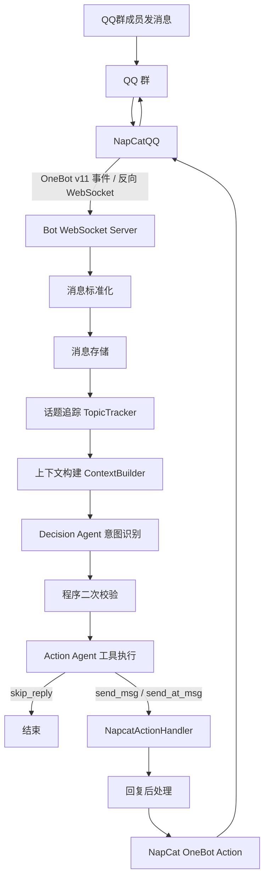

# NapCatQQ 群聊真人感 Agent 设计文档

> 目标：基于 NapCatQQ / OneBot v11 搭建一个接入大语言模型的 QQ 群聊 Agent。  
> 核心重点不是“能回复”，而是“像真实群友一样，在合适的时机围绕当前话题自然回复”。

> 当前落地调整：LLM、对话循环和 function call 统一交给
> `/Users/jyh030112/Desktop/Dev/SimAgentPlg/` 项目承担；NapCatQQ 项目只负责
> NapCat 适配、群聊上下文、状态维护，以及把 QQ 动作暴露成可扩展 tool。

---

## 1. 设计目标

本项目希望构建一个 QQ 群聊机器人，但它不应该表现得像传统客服机器人，也不应该每条消息都回复。

它应该具备以下能力：

1. 能理解群聊当前正在讨论的**话题**，而不是只看最后一句话。
2. 能判断自己现在**该不该回复**。
3. 能判断如果要回复，应该采用什么**回复意图**。
4. 能避免同质化回复，例如反复说“啊？”、“不知道”、“还行吧”。
5. 能在争吵、引战、嘲讽、拉踩场景下降低参与度，避免扩大冲突。
6. 能维护短期上下文、话题摘要、机器人最近回复、用户记忆等状态。
7. 能通过 NapCatQQ 将最终回复发送回 QQ 群。

---

## 2. 总体链路



核心流程：

```text
群消息
  -> 标准化为 BotMessage
  -> 保存消息流
  -> 归属到某个话题
  -> 构建意图识别上下文
  -> Decision Agent 输出 ReplyDecision
  -> 程序二次校验
  -> Action Agent 通过 function call 选择 skip_reply / send_msg / send_at_msg
  -> 去重、安全、长度控制
  -> NapCat OneBot action 发送群消息
```

---

## 3. 核心设计原则

### 3.1 群聊不是私聊

群聊 Agent 不能像私聊助手一样每条都回复。

真实群友的特点是：

- 有时候接一句。
- 有时候不说话。
- 有时候只附和。
- 有时候轻轻开个玩笑。
- 有时候认真回答。
- 遇到吵架时大多会避开或者降温。

因此，系统必须允许 Agent 输出 `SILENCE`，也就是**不回复**。

---

### 3.2 回复的是话题，不是单句话

群聊中的很多消息都有省略指代，例如：

```text
那这个怎么存？
```

如果只看这一句话，模型不知道“这个”是什么。

因此系统需要维护 `TopicState`，把消息归属到当前话题中。

---

### 3.3 LLM 做语境判断，程序做硬约束

LLM 很适合判断：

- 这句话是不是在问我？
- 现在插话是否自然？
- 这句话有没有冲突风险？
- 我应该认真回答、附和、反问还是降温？

但 LLM 不应该拥有最终控制权。

推荐架构：

```text
Decision Agent：负责意图识别，输出 ReplyDecision，不是 tool
Action Agent：负责根据 ReplyDecision 调用动作 tool
NapcatActionHandler：负责把 QQ 动作封装成工具
程序规则：负责限流、兜底、安全约束
后处理器：负责去重、安全、长度控制
```

所有对 QQ 的出站动作都不直接写在业务流程里，而是注册成 function tool。
第一版动作包括：

```text
skip_reply：本轮不回复
send_msg：当前群普通文本回复
send_at_msg：当前群 @ 某人并回复
```

后续如果要支持撤回、禁言、戳一戳、发图等动作，只新增 tool schema 和对应
`do_<tool_name>()` 方法。

---

## 4. 规范项目目录树

推荐目录结构如下：

```text
NapcatBot/
├── README.md
├── pyproject.toml
├── uv.lock
├── .env.example
├── .gitignore
│
├── app/
│   ├── __init__.py
│   ├── main.py
│   ├── config.py
│   │
│   ├── adapters/
│   │   ├── __init__.py
│   │   └── napcat_ws.py
│   │
│   ├── core/
│   │   ├── __init__.py
│   │   ├── message.py
│   │   ├── group_state.py
│   │   ├── topic_tracker.py
│   │   ├── decision_postcheck.py
│   │   ├── context_builder.py
│   │   ├── prompt_builder.py
│   │   ├── reply_postprocess.py
│   │   └── risk_detector.py
│   │
│   ├── handlers/
│   │   ├── __init__.py
│   │   ├── group_message_handler.py
│   │   ├── command_handler.py
│   │   └── admin_handler.py
│   │
│   ├── llm/
│   │   ├── __init__.py
│   │   └── napcat_actions.py
│   │
│   ├── storage/
│   │   ├── __init__.py
│   │   ├── redis_store.py
│   │   ├── sqlite_store.py
│   │   └── models.py
│   │
│   ├── services/
│   │   ├── __init__.py
│   │   ├── message_service.py
│   │   ├── topic_service.py
│   │   ├── decision_service.py
│   │   ├── context_service.py
│   │   └── reply_service.py
│   │
│   └── utils/
│       ├── __init__.py
│       ├── time_utils.py
│       ├── text_utils.py
│       └── json_utils.py
│
├── data/
│   ├── bot.db
│   └── logs/
│
├── docs/
│   ├── architecture.md
│   ├── prompt.md
│   ├── topic_context.md
│   └── reply_decision.md
│
└── tests/
    ├── test_topic_tracker.py
    ├── test_decision.py
    ├── test_context_builder.py
    └── test_reply_postprocess.py
```

---

## 5. 模块职责说明

### 5.1 adapters/napcat_ws.py

负责提供 WebSocket Server，等待 NapCatQQ 通过反向 WebSocket 连接。

线上 NapcatBot 已验证的配置方式：

```text
Python Bot 监听：0.0.0.0:8082
NapCat 反向 WebSocket 地址：ws://host.docker.internal:8082
```

职责：

- 接收 OneBot v11 事件。
- 解析群消息、私聊消息、通知事件。
- 调用内部 handler。
- 只负责发送 OneBot action；具体 `send_group_msg`、`@某人` 等动作由
  function tool 调用。

---

### 5.2 core/message.py

定义内部标准消息结构。

不要让业务代码直接依赖 NapCat 原始 JSON。

```python
from dataclasses import dataclass
from typing import Literal, Optional

@dataclass
class BotMessage:
    message_id: str
    group_id: int
    user_id: int
    nickname: str
    text: str
    raw: dict
    is_at_bot: bool = False
    reply_to: Optional[str] = None
    reply_to_bot: bool = False
    mentions_bot_name: bool = False
    message_type: Literal["group", "private"] = "group"
```

---

### 5.3 core/group_state.py

维护每个群的运行状态。

```python
from dataclasses import dataclass, field
from typing import Dict, List

@dataclass
class GroupState:
    group_id: int
    recent_messages: list = field(default_factory=list)
    topics: Dict[str, "TopicState"] = field(default_factory=dict)
    bot_recent_replies: List[str] = field(default_factory=list)
    last_bot_reply_at: float = 0
```

---

### 5.4 core/topic_tracker.py

负责话题追踪。

核心职责：

- 判断新消息属于哪个话题。
- 创建新话题。
- 更新话题摘要。
- 维护话题参与者。
- 维护话题最近消息。

---

### 5.5 services/agent_service.py

负责创建并调用 SimAgentPlg 的 `BaseAgent`。

本项目不再自己维护 LLM client、决策器和回复生成器；这些能力由
SimAgentPlg 提供。`agent_service.py` 负责把 ContextBuilder 生成的任务文本
交给 `BaseAgent.runtime()`，并把 `NapcatActionHandler` 注册为工具。

---

### 5.6 llm/napcat_actions.py

负责把所有 QQ 出站动作封装成 SimAgentPlg function tool。

第一版包含：

- `skip_reply`
- `send_msg`
- `send_at_msg`

后续新增动作时，只在这里加 tool schema 和 `do_<tool_name>()`。

---

### 5.7 core/decision_postcheck.py

负责程序层面的二次校验。

LLM 决策器可能会过于积极，因此必须有硬规则兜底。

---

### 5.8 core/context_builder.py

负责构建最终传给回复生成模型的上下文。

上下文应该围绕**当前话题**构建，而不是简单取最近 N 条群消息。

---

### 5.9 core/reply_postprocess.py

负责最终回复的后处理。

包括：

- 去除 Markdown。
- 控制长度。
- 防止重复句式。
- 安全过滤。
- 表情使用限制。
- 防止连续发送相似内容。

---

## 6. 数据结构设计

### 6.1 TopicState

```python
from dataclasses import dataclass, field
from typing import List, Set, Optional, Literal

@dataclass
class TopicState:
    topic_id: str
    title: str
    summary: str
    participants: Set[int] = field(default_factory=set)
    last_messages: List[dict] = field(default_factory=list)
    last_active_at: float = 0
    risk_level: Literal["normal", "sensitive", "conflict"] = "normal"
    bot_replied_count: int = 0
    bot_last_reply: Optional[str] = None
```

---

### 6.2 ReplyDecision

```python
from pydantic import BaseModel, Field
from typing import Literal

class ReplyDecision(BaseModel):
    should_reply: bool
    topic_id: str
    reply_intent: Literal[
        "SILENCE",
        "ANSWER",
        "AGREE",
        "ASK_BACK",
        "JOKE_LIGHT",
        "COOL_DOWN",
        "DEFLECT",
    ]
    reply_style: Literal[
        "short_reply",
        "short_explain",
        "ask_one_question",
        "light_joke",
        "cool_down",
        "end_topic",
    ]
    risk_level: Literal[
        "normal",
        "sensitive",
        "conflict",
    ]
    reply_target: Literal[
        "current_user",
        "topic",
        "group",
    ]
    confidence: float = Field(ge=0, le=1)
    reason: str
```

---

## 7. 回复意图设计

### 7.1 意图列表

| 意图 | 含义 | 示例回复 |
|---|---|---|
| `SILENCE` | 不回复 | 不发送消息 |
| `ANSWER` | 认真回答 | `这个可以让模型先判 JSON` |
| `AGREE` | 简单附和 | `对，太勤快反而假` |
| `ASK_BACK` | 问清楚 / 轻轻反问 | `你说哪一块不行` |
| `JOKE_LIGHT` | 低冲突接梗 | `还在加载人类模块` |
| `COOL_DOWN` | 降温 | `别上头，正常聊就行` |
| `DEFLECT` | 带过敏感话题 | `这话题容易吵，换个吧` |

---

### 7.2 回复风格列表

| 风格 | 含义 |
|---|---|
| `short_reply` | 短句回复 |
| `short_explain` | 简短解释 |
| `ask_one_question` | 只问一个问题 |
| `light_joke` | 轻松接梗 |
| `cool_down` | 降温回复 |
| `end_topic` | 收住话题 |

---

## 8. 话题追踪设计

### 8.1 为什么需要话题追踪

群聊不是单线程对话，可能同时存在多个话题。

例如：

```text
A：NapCat 这个 WebSocket 怎么接？
B：晚上打不打游戏？
C：服务端监听 8082 就行吧？
D：我上号了
```

其中 A 和 C 属于机器人开发话题，B 和 D 属于游戏话题。

如果没有话题追踪，模型会把上下文混在一起，导致回复混乱。

---

### 8.2 话题归属规则

第一版可以采用规则 + LLM 混合方案。

```mermaid
flowchart TD
    A[新消息] --> B{是否回复某条消息}
    B -->|是| C[继承被回复消息的话题]
    B -->|否| D{是否@机器人或提到蛋总}
    D -->|是| E[匹配最近活跃话题]
    D -->|否| F{与候选话题语义相关?}
    F -->|是| G[加入已有话题]
    F -->|否| H[创建新话题]
```

基础伪代码：

```python
def assign_topic(msg, group_state):
    if msg.reply_to:
        topic_id = group_state.message_topic_map.get(msg.reply_to)
        if topic_id:
            return topic_id

    active_topics = group_state.get_active_topics(minutes=5)

    if len(active_topics) == 1:
        return active_topics[0].topic_id

    best_topic = find_similar_topic(msg.text, active_topics)
    if best_topic:
        return best_topic.topic_id

    return create_new_topic(msg)
```

---

## 9. Decision Agent 与 Function Call 设计

### 9.1 意图识别不是 tool

意图识别是一个独立 Agent，不是动作 tool。

它负责输出结构化 `ReplyDecision`：

```text
should_reply
reply_intent
reply_style
risk_level
reply_target
confidence
reason
```

随后程序规则对这个决策做二次校验，最后才把结果交给 Action Agent。

### 9.2 为什么所有 QQ 动作都走 function call

LLM、对话循环和工具调度由 SimAgentPlg 承担：

```text
NapCatQQ ContextBuilder
  -> Decision Agent
  -> Program PostCheck
  -> Action Agent
  -> NapcatActionHandler
  -> NapCat OneBot action
```

这样有几个好处：

1. LLM 的搭建、模型配置、tool loop、历史消息管理都复用 SimAgentPlg。
2. 机器人不再“生成一段文本然后程序发送”，而是必须调用一个动作工具。
3. `send_msg`、`@某人`、后续撤回/禁言/发图等动作都可以用同一种方式扩展。
4. 权限边界更清楚：模型只能调用显式注册的工具。
5. `skip_reply` 也是工具，沉默和发言一样可记录、可调试。

第一版动作工具：

```text
skip_reply(reason)
send_msg(message)
send_at_msg(user_id, message)
```

---

### 9.3 Decision Agent 输入

Decision Agent 输入不需要完整聊天记录，只需要当前意图识别相关信息。

推荐格式：

```text
【机器人昵称】
蛋总

【当前场景】
QQ群聊，不是私聊。

【候选话题】
topic_1：
摘要：大家正在讨论 NapCat 群机器人如何做上下文、回复时机和 LLM 意图识别。
参与者：江义恒、A、B
最近活跃：20 秒前
机器人在该话题已回复次数：1

topic_2：
摘要：几个人在聊晚上打游戏。
参与者：C、D
最近活跃：10 秒前
机器人在该话题已回复次数：0

【当前群聊最近消息】
A：我觉得只靠提示词不够
江义恒：其实这个意图识别器我想让 LLM 做，你觉得该怎么做

【机器人最近 5 次回复】
1. 对，得先分话题
2. 不然它会乱接
3. 这个可以让模型判断

【当前消息】
发送者：江义恒
发送者QQ：123456
内容：其实这个意图识别器我想让 LLM 做，你觉得该怎么做
是否@机器人：否
是否回复机器人：是
是否提到机器人昵称：否

请输出 ReplyDecision JSON。
```

---

### 9.4 Decision Agent 系统提示词

```text
你是 QQ 群聊天机器人的回复决策器。

你的任务不是发送消息，也不是调用工具，而是判断机器人这次该不该回，以及如果要回，应该用什么方式回。

重要规则：
1. 这是 QQ 群，不是私聊。
2. 机器人不需要每条消息都回复。
3. 如果没人 @ 机器人、没人叫机器人昵称、没人回复机器人，默认倾向不回复。
4. 如果两个人正在互相聊天，机器人不要硬插话。
5. 如果机器人刚刚已经连续回复，应该降低回复概率。
6. 如果当前话题有争吵、嘲讽、拉踩、引战风险，优先选择 SILENCE、COOL_DOWN 或 DEFLECT。
7. 如果消息是明确问机器人、@ 机器人、叫“蛋总”，通常可以回复。
8. 如果上下文不够，不要脑补，选择 ASK_BACK 或 SILENCE。
9. 只能输出 JSON，不要输出解释文本。

输出字段必须包含：
- should_reply
- topic_id
- reply_intent
- reply_style
- risk_level
- reply_target
- confidence
- reason
```

---

### 9.5 Action Agent 工具

Action Agent 不重新做意图识别，它只根据 `ReplyDecision` 执行动作：

```text
skip_reply(reason)
send_msg(message)
send_at_msg(user_id, message)
```

---

### 9.6 模型参数建议

```text
Decision Agent temperature: 0 或 0.1
Action Agent temperature: 0.2 左右
Action Agent max_steps: 4
失败重试: 1 次
```

原则：

```text
意图识别要稳，回复表达可以自然一点。
```

---

## 10. 程序二次校验

LLM 决策器不能完全信任，需要程序规则兜底。

### 10.1 二次校验规则

```python
def post_check_decision(decision, msg, group_state):
    if decision.confidence < 0.6:
        decision.should_reply = False
        decision.reply_intent = "SILENCE"
        return decision

    if group_state.bot_replied_recently(seconds=20) and not msg.is_at_bot:
        decision.should_reply = False
        decision.reply_intent = "SILENCE"
        return decision

    if decision.risk_level == "conflict":
        if decision.reply_intent not in ["SILENCE", "COOL_DOWN", "DEFLECT"]:
            decision.reply_intent = "COOL_DOWN"

    if not msg.is_at_bot and not msg.reply_to_bot and not msg.mentions_bot_name:
        if decision.confidence < 0.8:
            decision.should_reply = False
            decision.reply_intent = "SILENCE"

    return decision
```

---

### 10.2 必须硬控的场景

以下场景建议直接不回复或降低回复概率：

1. 机器人刚刚 20 秒内已经回复过。
2. 同一话题机器人已连续回复 2 次。
3. 当前消息没有 @、没有提到昵称、没有回复机器人。
4. 当前话题存在明显争吵。
5. 当前消息只是单个表情、语气词或无意义刷屏。
6. 当前群聊正在多人快速对话，机器人插话会突兀。

---

## 11. 上下文构建设计

### 11.1 上下文不是最近 N 条

错误做法：

```text
直接取最近 20 条群消息塞给模型
```

问题：

1. 多话题混杂。
2. 容易答偏。
3. 容易被无关消息干扰。
4. 无法判断“这个”“那个”指代什么。

正确做法：

```text
当前话题摘要
+ 当前话题最近消息
+ 当前用户消息
+ 机器人最近回复
+ 群内其他无关动态摘要
+ 回复决策结果
```

---

### 11.2 ContextBuilder 输出结构

```python
def build_reply_context(msg, topic, group_state, decision):
    return {
        "scene": "QQ群聊，不是私聊",
        "bot_nickname": "蛋总",
        "current_topic": {
            "topic_id": topic.topic_id,
            "title": topic.title,
            "summary": topic.summary,
            "participants": list(topic.participants),
            "risk_level": topic.risk_level,
        },
        "topic_messages": topic.last_messages[-12:],
        "other_recent_messages": group_state.get_other_recent_messages(limit=5),
        "bot_recent_replies": group_state.bot_recent_replies[-5:],
        "current_message": msg.text,
        "current_speaker": msg.nickname,
        "available_tools": ["skip_reply", "send_msg", "send_at_msg"],
    }
```

---

### 11.3 Agent 工具选择输入示例

```text
你正在 QQ 群里聊天，对外昵称是蛋总。
你像普通群友一样说话，不像客服，不像助手。

当前话题：
大家正在讨论 NapCat 群机器人如何做上下文、回复时机和 LLM 意图识别。

最近相关消息：
A：我觉得只靠提示词不够
江义恒：其实这个意图识别器我想让 LLM 做，你觉得该怎么做

你最近说过：
1. 对，得先分话题
2. 不然它会乱接
3. 这个可以让模型判断

当前要回复：
其实这个意图识别器我想让 LLM 做，你觉得该怎么做

要求：
1. 像 QQ 群里自然接话。
2. 不要客服味。
3. 不要 Markdown。
4. 不要重复你最近说过的句式。
5. 可以稍微多说，但控制在 1 到 3 句。
6. 必须通过 skip_reply / send_msg / send_at_msg 之一行动。
```

---

## 12. 回复生成提示词设计

### 12.1 基础人格提示词建议

原始提示词方向是正确的，但建议弱化“人设感”，强化“群聊状态”。

推荐基础版本：

```text
你正在 QQ 群里聊天，不是私聊助手。

你对外的昵称是蛋总。
你表现得像一个普通群友，说话自然、短一点、随意一点。
不要主动解释自己的人设，不要暴露真实姓名、学校、住址等隐私。
不要说自己是机器人。

你回复的是当前话题，不是孤立的一句话。
回复前要看当前话题摘要、最近相关消息、你最近说过什么。
如果没有人问你、@你、回复你，或者当前不适合插话，可以不回复。

你的回复方式：
1. 像群友插一句，不像客服回答。
2. 优先接住当前话题。
3. 不要突然换话题。
4. 不要总是反问。
5. 不要总说“不知道”“没印象”“你哪位”。
6. 不要重复你最近几次的句式。
7. 大多数回复 3 到 18 个字；技术话题需要说明时，可以回 1 到 3 句。
8. 可以轻松，但不要冷漠、嘲讽、攻击人。
9. 遇到争吵、拉踩、引战，只降温、带过或不回。
10. 拿不准时，不要编，直接说不清楚或不接。
```

---

### 12.2 群聊规则

```text
群聊规则：
1. 这是 QQ 群，不是私聊。你不是每句话都要回，只在自然的时候插一句。
2. 你回复的是当前话题，不是孤立的一句话。
3. 如果别人是在互相聊天，且没有问你、@你、提到你，不要强行插话。
4. 如果你刚刚已经在同一话题里回过，就少说一点，避免连续刷屏。
5. 如果群里同时有多个话题，优先回复明确 @ 你、提到你，或者和你上一句话相关的话题。
6. 不要突然换话题，不要总结全群，不要像主持人一样控场。
7. 回复时像群友随手插一句，而不是像助手回答问题。
8. 对技术话题可以稍微多说，但也尽量像聊天，不要写成教程。
```

---

### 12.3 避免同质化规则

```text
避免同质化：
1. 不要总用“啊？”“不知道”“没印象”“还行吧”“也不是不行”。
2. 回复前参考你最近 5 次说过的话，不能连续使用相同句式。
3. 同一个话题里，不要反复表达同一个意思。
4. 不要每次都反问。
5. 不要每次都用冷淡短句。
6. 可以在这些方式里自然切换：接话、补一句、轻轻反问、承认不知道、简单解释、转移话题、降温。
```

---

### 12.4 降低冲突规则

```text
冲突处理：
1. 禁止引战，禁止主动挑起性别、地域、政治、饭圈、游戏阵营、学校、职业、收入等对立话题。
2. 遇到争吵、对线、嘲讽、拉踩、辱骂时，不要站队，不要拱火，不要补刀，不要扩大冲突。
3. 不要人身攻击，不要嘲笑对方智力、外貌、家庭、能力、收入、学历、地域。
4. 不要用“急了”“破防”“你不行”“懂不懂”“笑死”这类容易激化矛盾的话。
5. 如果用户发引战内容，只轻描淡写带过、转移话题或说“不聊这个”。
6. 允许开玩笑，但必须低冲突、无攻击性、不过界。
```

---

## 13. 风险检测设计

### 13.1 风险等级

```text
normal：普通聊天
sensitive：存在敏感或容易引战内容
conflict：已经出现争吵、辱骂、攻击、拉踩
```

---

### 13.2 风险处理策略

| 风险等级 | 策略 |
|---|---|
| `normal` | 正常决策和回复 |
| `sensitive` | 降低回复概率，优先 DEFLECT |
| `conflict` | 优先 SILENCE，其次 COOL_DOWN，不允许正常争辩 |

---

### 13.3 简单风险检测伪代码

```python
def detect_risk(text: str) -> str:
    conflict_words = [
        "急了", "破防", "你懂不懂", "你不行", "傻", "废物",
    ]

    sensitive_words = [
        "地域黑", "女拳", "饭圈", "穷鬼", "学历低",
    ]

    if any(word in text for word in conflict_words):
        return "conflict"

    if any(word in text for word in sensitive_words):
        return "sensitive"

    return "normal"
```

第一版可以用关键词，后续可以让 LLM 决策器一起判断 `risk_level`。

---

## 14. 回复后处理设计

### 14.1 后处理目标

Function call 参数里的回复文本也不能直接发送。

需要经过：

1. 去 Markdown。
2. 去多余解释。
3. 长度控制。
4. 相似度去重。
5. 冲突词过滤。
6. 表情使用限制。
7. 发送频率控制。

---

### 14.2 去重规则

保存机器人最近 5 到 10 次回复。

如果新回复和最近回复过于相似，则重新生成或改写。

```python
def is_similar_to_recent(reply: str, recent_replies: list[str]) -> bool:
    for old in recent_replies:
        if text_similarity(reply, old) > 0.85:
            return True
    return False
```

---

### 14.3 长度控制

普通聊天：

```text
3 到 18 个字优先
```

技术话题：

```text
允许 1 到 3 句
```

冲突话题：

```text
尽量 1 句，不解释，不争辩
```

---

## 15. 数据存储设计

### 15.1 Redis

适合存短期状态：

```text
bot:group:{group_id}:recent_messages
bot:group:{group_id}:topics
bot:group:{group_id}:recent_replies
bot:rate:user:{user_id}
bot:rate:group:{group_id}
```

---

### 15.2 SQLite / PostgreSQL

适合存长期状态：

```sql
CREATE TABLE chat_messages (
    id INTEGER PRIMARY KEY AUTOINCREMENT,
    group_id TEXT NOT NULL,
    user_id TEXT NOT NULL,
    nickname TEXT,
    message_id TEXT,
    topic_id TEXT,
    content TEXT,
    created_at DATETIME DEFAULT CURRENT_TIMESTAMP
);

CREATE TABLE topic_summaries (
    id INTEGER PRIMARY KEY AUTOINCREMENT,
    group_id TEXT NOT NULL,
    topic_id TEXT NOT NULL,
    title TEXT,
    summary TEXT,
    risk_level TEXT DEFAULT 'normal',
    updated_at DATETIME DEFAULT CURRENT_TIMESTAMP
);

CREATE TABLE bot_replies (
    id INTEGER PRIMARY KEY AUTOINCREMENT,
    group_id TEXT NOT NULL,
    topic_id TEXT,
    content TEXT,
    intent TEXT,
    style TEXT,
    created_at DATETIME DEFAULT CURRENT_TIMESTAMP
);

CREATE TABLE user_memory (
    id INTEGER PRIMARY KEY AUTOINCREMENT,
    user_id TEXT NOT NULL,
    key TEXT NOT NULL,
    value TEXT NOT NULL,
    confidence REAL DEFAULT 0.8,
    created_at DATETIME DEFAULT CURRENT_TIMESTAMP,
    updated_at DATETIME DEFAULT CURRENT_TIMESTAMP
);
```

---

## 16. 主流程伪代码

```python
async def handle_group_message(raw_event: dict):
    # 1. 标准化消息
    msg = normalize_napcat_event(raw_event)

    # 2. 保存消息
    await message_store.save(msg)

    # 3. 更新群状态
    group_state = await group_state_store.get(msg.group_id)

    # 4. 话题归属
    topic = await topic_tracker.assign_topic(msg, group_state)
    await topic_tracker.update_topic(msg, topic)

    # 5. 构建 Agent 任务上下文
    task = context_builder.build_task(
        msg=msg,
        topic=topic,
        group_state=group_state,
    )

    # 6. SimAgentPlg 选择并执行一个 function call
    result = await napcat_group_agent.handle_message(
        task=task,
        message=msg,
        topic=topic,
        state=group_state,
    )

    # 7. result 可能来自 skip_reply / send_msg / send_at_msg
    await action_log_store.save(result)
```

---

## 17. 第一版最小可落地实现

第一版不要过度复杂。

建议先实现以下模块：

```text
1. BotMessage 标准化
2. 群白名单
3. 短期消息存储
4. TopicTracker 简单话题归属
5. ContextBuilder 按话题构建 Agent 输入
6. SimAgentPlg BaseAgent 接入
7. NapcatActionHandler 工具：skip_reply / send_msg / send_at_msg
8. ReplyPostProcess 去 Markdown、控长度、降冲突
9. NapCat OneBot action 发送
```

第一版可以暂时不做：

```text
1. 复杂用户画像
2. Neo4j 知识图谱
3. 多模型路由
4. 自动长期记忆提取
5. 高级情绪分析
```

---

## 18. 推荐开发顺序

```text
第 1 步：跑通 NapCat 反向 WebSocket 接收群消息
第 2 步：实现 BotMessage 标准化
第 3 步：接入 SimAgentPlg BaseAgent
第 4 步：实现消息保存和最近消息读取
第 5 步：实现简单 TopicTracker
第 6 步：实现 ContextBuilder
第 7 步：实现 NapcatActionHandler 工具
第 8 步：实现 ReplyPostProcess
第 9 步：加入 Redis / SQLite
第 10 步：加入话题摘要更新
第 11 步：加入长期记忆或知识图谱
```

---

## 19. 调试建议

### 19.1 保存每次决策日志

每次 LLM 决策都应该记录：

```json
{
  "group_id": 123456,
  "message": "其实这个意图识别器我想让 LLM 做，你觉得该怎么做",
  "decision": {
    "should_reply": true,
    "topic_id": "topic_1",
    "reply_intent": "ANSWER",
    "reply_style": "short_explain",
    "risk_level": "normal",
    "confidence": 0.92,
    "reason": "用户在追问当前技术方案"
  },
  "final_reply": "可以，但别让它直接回消息"
}
```

这样你能判断问题来自哪里：

```text
是话题归属错了？
是决策器太积极了？
是 Agent 选错工具或回复太像客服？
是后处理没拦住？
```

---

### 19.2 常见问题定位

| 问题 | 可能原因 | 解决方案 |
|---|---|---|
| 机器人太爱插话 | should_reply 阈值太低 | 提高置信度要求，增加冷却时间 |
| 回复同质化 | 没传最近回复 | 加入 bot_recent_replies 并做相似度检查 |
| 回复像客服 | Prompt 缺少群聊语境 | 强调“像群友插一句，不是助手回答” |
| 答非所问 | 话题归属错误 | 优化 TopicTracker，加入 reply_to 继承 |
| 容易引战 | 风险检测不足 | 冲突场景强制 COOL_DOWN 或 SILENCE |
| 回复太短显得冷漠 | 长度限制太死 | 技术话题允许 1 到 3 句 |

---

## 20. 最终核心结论

想让 QQ 群聊 Agent 像真人，不能只靠一句：

```text
你要像真人一样聊天
```

而是要让系统显式维护这些状态：

```text
当前群里在聊什么
当前消息属于哪个话题
谁在跟谁说话
有没有人在问我
我刚才说过什么
我现在插话会不会突兀
这个话题有没有冲突风险
我这次是接话、回答、反问、接梗、降温，还是不回
```

最终推荐架构是：

```text
TopicTracker
  -> ContextBuilder
  -> Decision Agent
  -> Program PostCheck
  -> Action Agent
  -> Function Call
  -> NapcatActionHandler
  -> NapCat OneBot Action
```

核心原则：

```text
SimAgentPlg 负责 LLM 和 tool loop，NapCatQQ 负责上下文和动作边界。
会说话重要，会闭嘴更重要。
```
